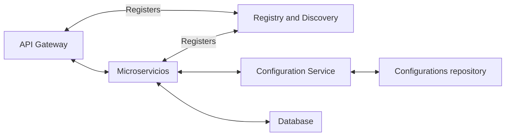

# MICROSERVICES
## Description
Microservices practice project

## Diagram

```mermaid
flowchart LR

  G[API Gateway]
  RS[Registry and Discovery]
  C[Configuration Service]
  CR[Configurations repository]
  subgraph MS[Microservicios]
    direction TB
  end

  subgraph DB[Database]
    direction TB
  end

  G <-- Registers --> RS
  G <--> MS
  MS <-- Registers --> RS
  MS <--> C
  MS <--> DB
  C <--> CR
  

  click RS "https://github.com/SaulMMBP/microservices-registry-service" _blank
  click G "https://github.com/SaulMMBP/microservices-gateway-service" _blank

```
